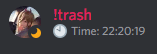
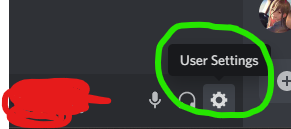
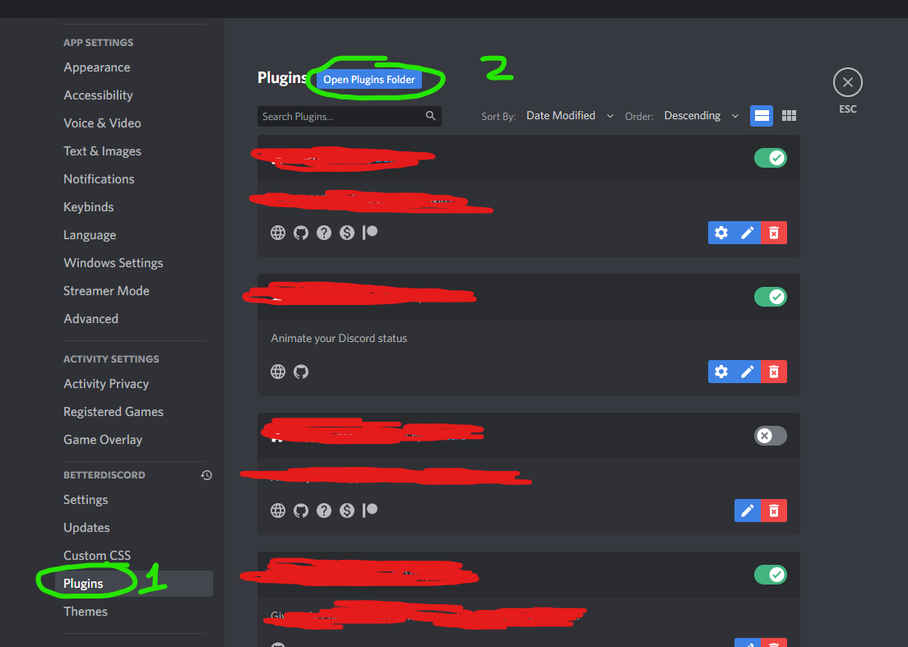
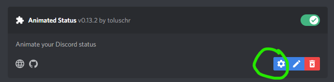

# BetterDiscord Animated Status Date Time Plugins
## Navigation
- [Showcase](#show)
- [Download and tutorial](#down_main)
	- [Download Better Discord and Animated Status Plugin (if you haven't done):](#better_disc_anim)
	- [Download my `AnimatedStatus.config.json` file:](#json_download)

## Showcase
- This is what this plugin will make your discord's status look like:
	- 

## Download and tutorial

### Download Better Discord and Animated Status Plugin (if you haven't done):
1. Download [Better Discord](https://betterdiscord.app/) first before you can use mine one.
2. After that, make sure to visit [toluschr's github to download animated status plugin for the latest version](https://github.com/toluschr/BetterDiscord-Animated-Status)
3. Open Discord, goto **User Settings** _at the bottom left hand corner_:
	- 
4. _Scroll down_, select **Plugins**, then click on **Open Plugins Folder** to put your downloaded animated status plugin you've done at the previous step.
	- 
5. After that, Do **Ctrl \+ R** to reset Discord. Then navigate to the **Plugins** section like how you did in the previous step.
6. Goto Settings of the plugin you have downloaded
	- 
7. Type something random and **save** it so it will generate **AnimatedStatus.config.json** inside the **plugins** folder.

### Download my `AnimatedStatus.config.json` file:
- After complete step 7 above, [download mine one](https://github.com/nicknggt/BetterDiscord-Animated-Status-Date-Time-Plugins/releases/download/v1.0/plugins.zip) to replace the file **AnimatedStatus.config.json** in the **plugins** folder.